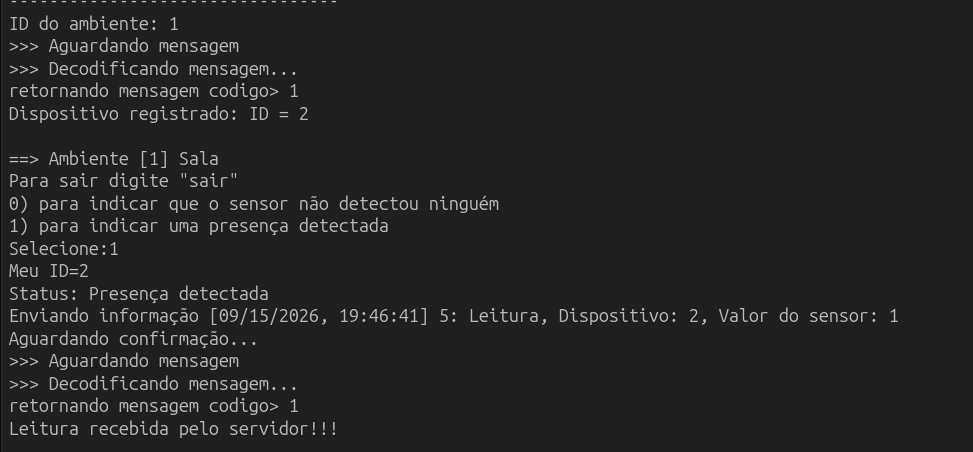
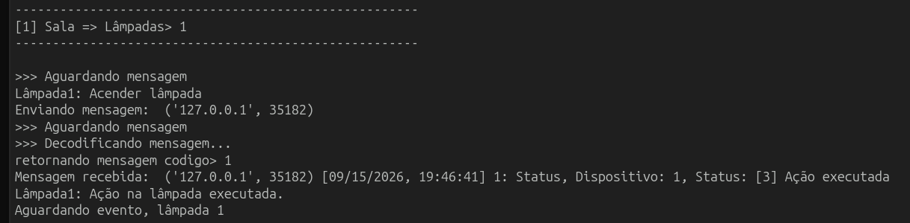
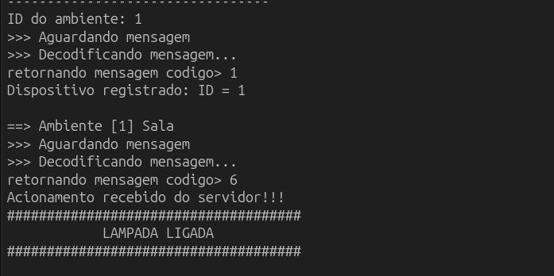
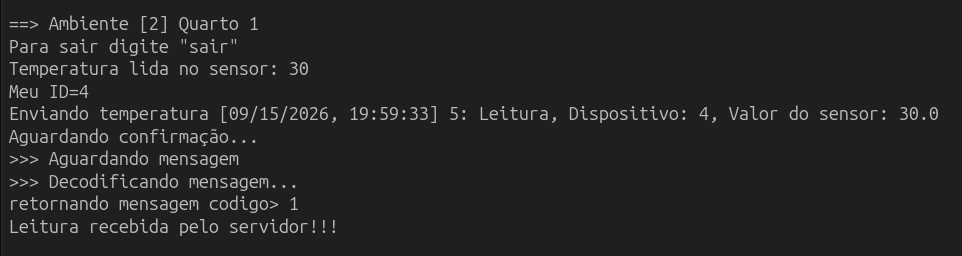
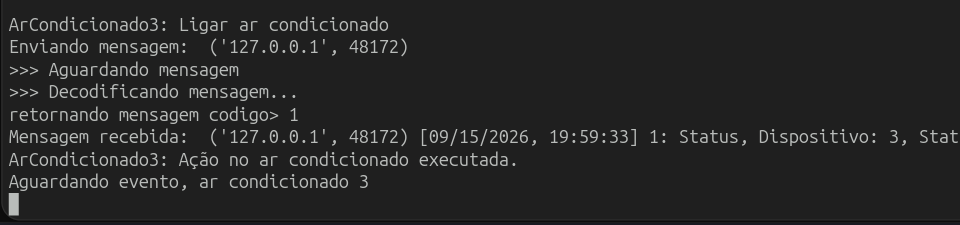
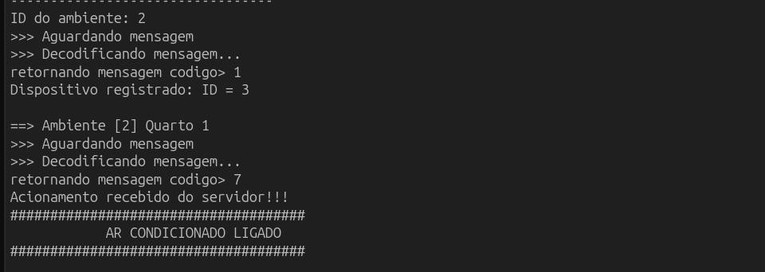

# Trabalho sockets

Este repositório contém o trabalho desenvolvido pela aluna Ana Júlia C. Martins para a disciplina de Redes de Computadores do curso Mestrado Profissional em Computação Aplicada pelo Instituto Federal do Espírito Santo, semestre 2026/2. O projeto tem como objetivo compreender os fundamentos de Sockets.

## Sockets TCP no contexto do sistema

### O que é um socket TCP

Um _socket_ é o ponto de comunicação entre dois processos, seja na mesma máquina ou pela rede.

No código, `AF_INET` indica que a comunicação usa endereçamento IPv4, e `SOCK_STREAM` indica que o protocolo de transporte é TCP. O TCP fornece um serviço de comunicação confiável, ordenado e orientado à conexão: uma vez que o `connect()` (no cliente) e o `accept()` (no servidor) são bem-sucedidos, é criado um canal bidirecional de comunicação por onde os dados são transmitidos como um fluxo contínuo de _bytes_.

### TCP é um fluxo de bytes, não um fluxo de mensagens

O TCP **não tem noção de "mensagem"**, ele enxerga apenas uma sequência contínua de _bytes_. Quando o código chama:

```python
connection.send(msg.pack(...))
```

ele está apenas entregando um conjunto de _bytes_ para a pilha TCP transmitir. O TCP é livre para:

- Juntar vários `send()` consecutivos em um único segmento de rede e entregá-los de uma vez em um único `recv()` do outro lado;
- Fragmentar um `send()` grande em vários segmentos, exigindo vários `recv()` para recompor os dados originais;
- Entregar os dados em pedaços cujo tamanho é decidido pelo sistema operacional, pela MTU (_Maximum Transmission Unit_) da rede, por retransmissões, por algoritmos, etc. Nada disso é controlado pela aplicação.

Ou seja: **não existe garantia de correspondência 1:1 entre um `send()` e um `recv()`**. Isso é diferente de um protocolo orientado a datagramas (como UDP), onde cada `sendto()` normalmente corresponde a um `recvfrom()` inteiro.

### O buffer TCP

Cada extremidade da conexão TCP mantém _buffers_ internos (gerenciados pelo sistema operacional):

- _Buffer_ de envio: quando a aplicação chama `send()`, os dados são copiados para o _buffer_ de envio do _socket_ e o _kernel_ se encarrega de transmiti-los em segmentos, no ritmo permitido pela rede (controle de fluxo/congestionamento).
- _Buffer_ de recepção: os _bytes_ que chegam pela rede são armazenados no _buffer_ de recepção do _socket_ até que a aplicação os retire chamando `recv()`.

Ao chamar `connection.recv(TAM_BUFFER)`, o código está pedindo "me dê até `TAM_BUFFER` _bytes_ que já estiverem disponíveis no _buffer_ de recepção agora". O `recv()` pode retornar:

- Menos _bytes_ do que uma mensagem completa (se ela ainda não chegou por inteiro);
- Exatamente os _bytes_ de uma mensagem;
- Os _bytes_ de uma mensagem + o começo (ou o todo) da mensagem seguinte, se ambas já chegaram e estão no _buffer_.

### Framing de mensagens

O sistema implementa um mecanismo de delimitação de mensagens (message _framing_) sobre o fluxo de _bytes_ do TCP, usando um _buffer_ de aplicação próprio, separado do _buffer_ do _socket_. A lógica é:

1. Cada mensagem tem um formato binário fixo e conhecido, definido pelas máscaras de `struct` (`!BdIH`, `!BdIB`, etc.) em cada classe de `Message`. O primeiro _byte_ é sempre o `code`, que identifica o tipo da mensagem. Isso permite saber qual é o tamanho esperado daquela mensagem.

2. `ReceiveMessage()` acumula _bytes_ até ter uma mensagem completa:
   ```python
   if not device.buffer or len(device.buffer) == 0:
       device.buffer = connection.recv(TAM_BUFFER)
   while True:
       if device.buffer and len(device.buffer) > 0:
           msg, device.buffer = getMessage(device.buffer)
       if msg != None:
           return msg
       dataBin = connection.recv(TAM_BUFFER)
       ...
       device.buffer = device.buffer + dataBin
   ```
   Ou seja: se o `getMessage()` olhar para o _buffer_ e perceber que ainda não há _bytes_ suficientes para montar uma mensagem inteira, ele retorna `None` e devolve o _buffer_ intacto. O laço então chama `recv()` de novo, concatenando os novos _bytes_ até que haja dados suficientes.

3. `getMessage()` também trata sobra de bytes: depois de extrair uma mensagem completa do início do _buffer_, ele remove exatamente esses _bytes_ e devolve o restante. Esse restante pode já conter o início (ou até mensagens completas) de comunicações seguintes, que serão processadas nas próximas chamadas.

### Por que isso é necessário

Sem esse tratamento, o código poderia falhar de duas formas:

- Se um `recv()` retornasse apenas metade dos _bytes_, tentar fazer `unpack` geraria um erro, pois o tamanho dos dados não bateria com o tamanho esperado pela máscara.
- Se um `recv()` retornasse os _bytes_ de duas mensagens coladas, o código que assumisse "um `recv()` = uma mensagem" acabaria descartando ou interpretando incorretamente a segunda mensagem, corrompendo a máquina de estados do dispositivo.

**O TCP garante entrega ordenada e confiável de _bytes_, mas cabe à aplicação impor a própria noção de "mensagem" sobre esse fluxo**.

## O Protocolo de Comunicação

Todas as mensagens trocadas entre cliente e servidor são definidas em `Message.py`, cada uma como uma subclasse de `Message`, com um código identificador (`Config.py`) e uma máscara de empacotamento binário (`struct`).

Toda mensagem do protocolo começa com os mesmos dois campos, na mesma ordem, antes de qualquer campo específico:

```
[ code : 1 byte  ][ dateTime : 8 bytes ][ ... campos específicos ... ]
```

Isso é visível na máscara de cada classe, todas começam com `'!Bd...'`:

- `!` → indica *network byte order* (_big-endian_), garantindo que cliente e servidor interpretem os bytes da mesma forma independentemente da arquitetura da máquina.
- `B` → código da mensagem (`code`), inteiro sem sinal de 1 _byte_ (0–255). É o campo que identifica o tipo da mensagem e é o primeiro _byte_ lido por `getMessage()` para decidir como decodificar o restante.
- `d` → data e hora (`dateTime`), um `double` de 8 _bytes_, gerado por `unixTimeStamp()` (_timestamp_ Unix, em ponto flutuante, no fuso de São Paulo). Serve para registrar o instante em que a mensagem foi criada, útil para logging/auditoria.

Depois desses dois campos fixos (total de 9 _bytes_ de cabeçalho comum), cada mensagem adiciona seus próprios campos. Quando um desses campos é um ID de dispositivo (`deviceID`), ele é empacotado como `I` (inteiro sem sinal de _4 bytes_).

### Detalhamento de cada mensagem

**1) `MessageRegister` (código 2): Cliente → Servidor**.
Máscara: `'!BdB'` → 1+8+1 = 10 bytes

| Campo | Tipo/tamanho | Descrição |
|---|---|---|
| code | B (1 byte) | `MSG_REGISTRO` = 2 |
| dateTime | d (8 bytes) | _timestamp_ |
| deviceType | B (1 byte) | tipo do dispositivo: 1 = Lâmpada, 2 = Sensor de Presença, 3 = Termômetro, 4 = Ar Condicionado |

É a primeira mensagem enviada por qualquer cliente ao conectar, feita em `ClientRegister()`.

**2) `MessageList` (código 3): Servidor → Cliente**.
Máscara do cabeçalho: `'!BdH'` → 1+8+2 = 11 bytes, mais um bloco repetido `'!H20s'` (2+20 = 22 bytes) por ambiente

| Campo | Tipo/tamanho | Descrição |
|---|---|---|
| code | B (1 byte) | `MSG_LISTA_AMBIENTES` = 3 |
| dateTime | d (8 bytes) | _timestamp_ |
| countRooms | H (2 bytes) | quantidade de ambientes cadastrados |
| *(repetido countRooms vezes)* roomID | H (2 bytes) | ID do ambiente |
| *(repetido countRooms vezes)* roomName | 20s (20 bytes) | nome do ambiente, string codificada em UTF-8 |

É a resposta do servidor ao registro, enviada em `WorkStart()`. É a única mensagem de tamanho variável, por isso `getMessage()` precisa ler `countRooms` antecipadamente (via `struct.unpack('!BdH', buffer[:11])`) antes de saber o tamanho total a esperar.

**3) `MessageSelect` (código 4): Cliente → Servidor**.
Máscara: `'!BdH'` → 1+8+2 = 11 bytes

| Campo | Tipo/tamanho | Descrição |
|---|---|---|
| code | B (1 byte) | `MSG_SELECIONA_AMBIENTE` = 4 |
| dateTime | d (8 bytes) | timestamp |
| roomID | H (2 bytes) | ID do ambiente escolhido pelo usuário |

**4) `MessageStatus` (código 1): Servidor → Cliente (majoritariamente)**.
Máscara: `'!BdIH'` → 1+8+4+2 = 15 bytes

| Campo | Tipo/tamanho | Descrição |
|---|---|---|
| code | B (1 byte) | `MSG_STATUS` = 1 |
| dateTime | d (8 bytes) | timestamp |
| deviceID | I (4 bytes) | ID atribuído ao dispositivo (0 se ainda não registrado) |
| status | H (2 bytes) | código de status/erro (`DISPOSITIVO_REGISTRADO`, `LEITURA_RECEBIDA`, `ACAO_EXECUTADA`, ou algum `ERRO_*`) |

Usada em vários pontos: confirmar o registro no ambiente (`DISPOSITIVO_REGISTRADO`), confirmar recebimento de leitura de sensor (`LEITURA_RECEBIDA`), confirmar execução de ação em atuador (`ACAO_EXECUTADA`), e reportar erros.

**5) `MessageSensor` (código 5): Cliente → Servidor**.
Máscara: `'!BdIf'` → 1+8+4+4 = 17 bytes

| Campo | Tipo/tamanho | Descrição |
|---|---|---|
| code | B (1 byte) | `MSG_SENSOR` = 5 |
| dateTime | d (8 bytes) | timestamp |
| deviceID | I (4 bytes) | ID do dispositivo sensor |
| value | f (4 bytes) | valor lido — temperatura (float) ou presença detectada/não detectada (0 ou 1) |

**6) `MessageLamp` (código 6): Servidor → Cliente (comando) e Cliente → Servidor (confirmação, via `MessageStatus`)**.
Máscara: `'!BdIB'` → 1+8+4+1 = 14 bytes

| Campo | Tipo/tamanho | Descrição |
|---|---|---|
| code | B (1 byte) | `MSG_LAMPADA` = 6 |
| dateTime | d (8 bytes) | timestamp |
| deviceID | I (4 bytes) | ID da lâmpada |
| action | B (1 byte) | `LUZ_APAGADA` (0) ou `LUZ_ACESA` (1) |

**7) `MessageAr` (código 7): mesmo formato de `MessageLamp`**.
Máscara: `'!BdIB'` → 14 bytes

| Campo | Tipo/tamanho | Descrição |
|---|---|---|
| code | B (1 byte) | `MSG_AR`  |
| dateTime | d (8 bytes) | timestamp |
| deviceID | I (4 bytes) | ID do ar-condicionado |
| action | B (1 byte) | `AR_DESLIGADO` (0) ou `AR_LIGADO` (1) |

### Ordem das mensagens (sequência do protocolo)

A ordem é controlada pela máquina de estados de `DeviceThread.py`, através da tabela `expectTable`, indexada pelo estado atual (`deviceStatus`). Isso define, para cada estado, qual o único tipo de mensagem que é aceito a seguir. Qualquer mensagem fora de ordem gera `ERRO_MENSAGEM_NAO_ESPERADA` e encerra a conexão.

**Fase 1: Registro (todos os dispositivos):**
1. Cliente → Servidor: `MessageRegister` (tipo do dispositivo)
2. Servidor → Cliente: `MessageList` (lista de ambientes), ou `MessageStatus` com `ERRO_DISPOSITIVO_NAO_SUPORTADO` em caso de falha
3. Cliente → Servidor: `MessageSelect` (ambiente escolhido)
4. Servidor → Cliente: `MessageStatus` com `DISPOSITIVO_REGISTRADO` (contendo o novo `deviceID`), ou `ERRO_AMBIENTE_INVALIDO`

**Fase 2a: Dispositivo sensor (presença/temperatura), laço repetido:**

5. Cliente → Servidor: `MessageSensor` (valor lido)
6. Servidor → Cliente: `MessageStatus` com `LEITURA_RECEBIDA`

**Fase 2b: Dispositivo atuador (lâmpada/ar), laço repetido:**

5. Servidor → Cliente: `MessageLamp` (ação a executar, o servidor só envia isso quando chega um comando na fila interna do ambiente)
6. Cliente → Servidor: `MessageStatus` com `ACAO_EXECUTADA`

Sensores iniciam o envio de dados, enquanto atuadores aguardam passivamente um comando do servidor.


## Fluxograma do Sistema


## Roteiro de Testes

### Etapa 1: Iniciar o servidor

Dentro da pasta `src`, abra o 1º terminal e execute:
```bash
python Server.py
```

Ele vai carregar os ambientes e dispositivos e inicializar o servidor.

---

### Etapa 2 — Registrar uma Lâmpada

Abra o 2º terminal:
```bash
python Cliente_Lampada.py
```

O cliente vai exibir a lista de ambientes. Digite um ID de ambiente, por exemplo `1` (Sala).

O que observar:
- No terminal do **cliente**: confirmação do registro com o ID atribuído
- No terminal do **servidor**: logs de conexão, registro do tipo, envio da lista, seleção do ambiente e inclusão na fila de controle

---

### Etapa 3 — Registrar um Sensor de Presença no mesmo ambiente

Abra o 3º terminal:
```bash
python Cliente_Presenca.py
```

Selecione o mesmo ambiente da lâmpada.

---

### Etapa 4 — Simular o sensor de presença (acionar a lâmpada)

No terminal do `Cliente_Presenca`, você verá:
```
0) para indicar que o sensor não detectou ninguém
1) para indicar uma presença detectada
Selecione:
```

**Teste 4a: Digite `1` (presença detectada):**

Observe em sequência:
- Terminal do sensor: confirmação `Leitura recebida pelo servidor!!!`

- Terminal do servidor: log do sensor + log do controle geral enviando comando para a fila da lâmpada

- Terminal da lâmpada: recebe o comando e imprime `LAMPADA LIGADA`



**Teste 4b: Digite `0` (sem presença):**

A lâmpada deve receber o comando e imprimir `LAMPADA DESLIGADA`.

---

### Etapa 5 — Registrar o Sensor de Temperatura e o Ar Condicionado

Abra o 4º terminal:
```bash
python Cliente_Temperatura.py
```

E o 5º terminal:
```bash
python Cliente_Ar.py
```

Selecione o mesmo ambiente nos dois (ex: `2`: Quarto 1).

---

### Etapa 6 — Simular leituras de temperatura (acionar o ar condicionado)

No terminal do `Cliente_Temperatura`, você verá:
```
Temperatura lida no sensor:
```

**Teste 6a: Digite `30` (temperatura alta, ≥ 25°C):**

Observe:
- Terminal do sensor: `Leitura recebida pelo servidor!!!`

- Terminal do servidor: log do controle decidindo ligar o ar (`AR_LIGADO`)

- Terminal do ar condicionado: `AR CONDICIONADO LIGADO`


**Teste 6b: Digite `20` (temperatura baixa, < 25°C):**

O ar condicionado deve receber o comando e imprimir `AR CONDICIONADO DESLIGADO`.

---